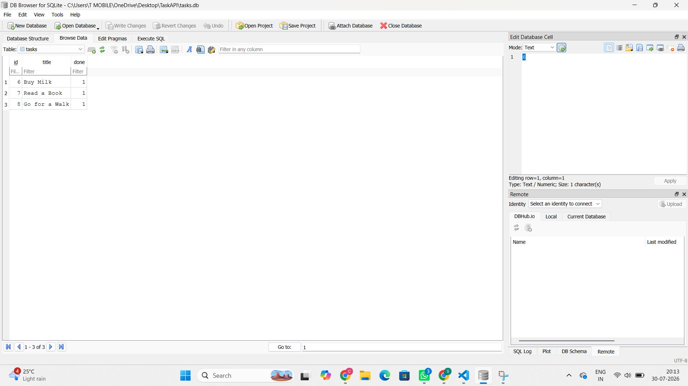

# Task API

This is a simple CRUD (Create, Read, Update, Delete) REST API built using FastAPI and SQLite. It allows users to create, view, update, and delete tasks. Unlike the first version of this project, the data is now stored in a SQLite database, so it is not lost when the server is restarted.

# Features
View all tasks
View a task by its ID
Create a new task
Update an existing task
Delete a task
Health check endpoint
Data is stored permanently using SQLite

# Why SQLite?
I chose SQLite because it is simple to set up and doesn't require a separate database server. Everything is stored in a single file called tasks.db, making it a great choice for small projects and learning backend development.

# Database
-> Database file: tasks.db
-> Table name: tasks

The table contains the following columns:
. id – Integer (Primary Key)
. title – Text
. done – Boolean

The database and table are created automatically the first time the project runs. Three sample tasks are also added if the table is empty.

# Installation

Install the required packages:

pip install -r requirements.txt

# Running the Project
Start the FastAPI server using:

py -m uvicorn database:app --reload

Once the server is running, open the following link in your browser to test the API:

http://127.0.0.1:8000/docs

# Example SQL Query
One of the SQL queries used during this project:

SELECT * FROM tasks;

# Database Screenshot

# API Endpoints
Method	Endpoint	Description
GET	/	Welcome message
GET	/health	Check if the API is running
GET	/tasks	Get all tasks
GET	/tasks/{task_id}	Get a task by its ID
POST	/tasks	Create a new task
PUT	/tasks/{task_id}	Update an existing task
DELETE	/tasks/{task_id}	Delete a task
